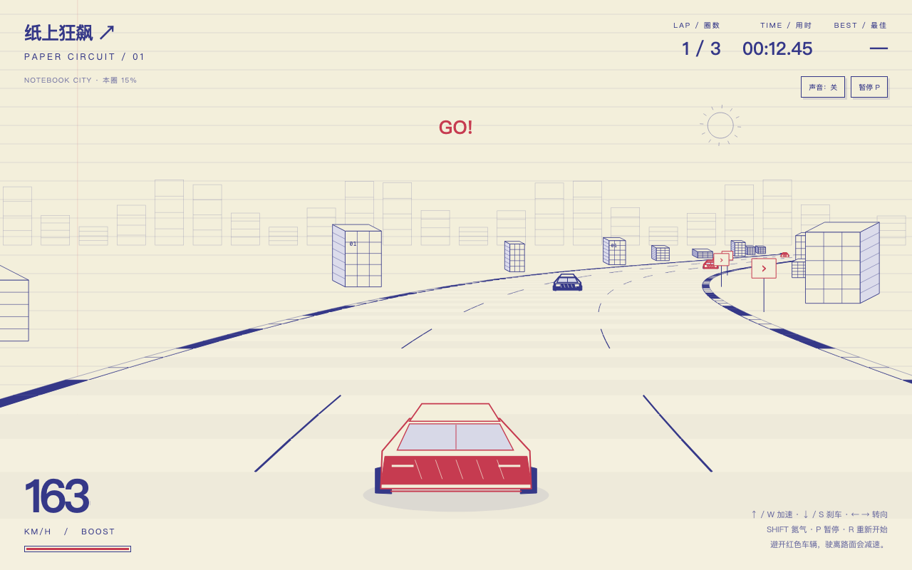

# 纸上狂飙 · Paper Circuit

一款运行在浏览器里的手绘风赛车小游戏。米色横线纸、蓝色线稿城市和红色赛车，把笔记本变成赛道。

**[在线试玩（Hugging Face Spaces）](https://huggingface.co/spaces/zongyuhong/paper-racer)**



## 游戏玩法

驾驶赛车完成三圈比赛，避开车流、控制弯道速度，挑战更短的完赛时间。

- 连续弯道与城市线框场景。
- 对手车辆与碰撞减速。
- 氮气加速：使用时消耗，不使用时自动恢复。
- 驶离赛道路面会减速。
- 三圈计时、暂停和重新开始。
- 最佳完赛成绩保存在当前浏览器中。
- 支持键盘；触屏设备提供转向、油门、刹车和氮气按钮。
- 可选引擎音效，默认关闭。

## 操作方式

| 按键 | 功能 |
| --- | --- |
| ↑ | 加速 |
| ↓ | 刹车 |
| ← / → | 左转 / 右转 |
| Shift | 配合油门使用氮气加速 |
| P / Esc | 暂停 / 继续 |
| R | 重新开始比赛 |
| Enter | 在开始或结算界面开始比赛 |

点击“开始比赛”，倒计时结束后按住 ↑ 行驶。若游戏嵌入在网页中，先点击游戏区域，让它获得键盘焦点。

## 本地运行

下载 `index.html`，用 Chrome、Edge 或其他现代浏览器打开即可。

不需要安装依赖、启动服务器或连接网络。声音需要手动点击“声音：关”开启。

## 项目文件

```text
paper-racer/
├── index.html      # 完整游戏：界面、样式和逻辑
├── README.md       # 项目说明
└── 游戏预览.png    # README 展示图片，可选
```

游戏实际运行只需要 `index.html`。不需要额外的 `style.css`、图片资源或构建步骤。

## 技术实现

- 原生 HTML、CSS 和 JavaScript。
- Canvas 2D 绘制纸张背景、道路、建筑和赛车。
- 透视投影实现伪 3D 街机赛车效果，不依赖三维游戏引擎。
- `requestAnimationFrame` 驱动画面更新。
- Web Audio API 合成引擎音效。
- `localStorage` 保存个人最佳成绩；它不是联网排行榜，不会跨设备同步。


这是一个轻量的单机街机赛车原型，重点是手绘视觉和简单易玩的驾驶体验，不模拟真实车辆物理，也不包含多人联机。

本项目尚未指定开源许可证。公开仓库不等于授予任意复制、修改或商业使用的许可；如需正式开源，可由项目所有者选择并添加 `LICENSE`。
